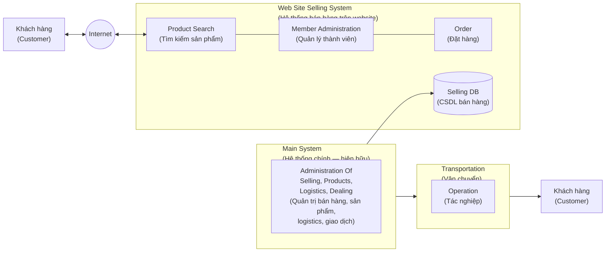

# RFP — ABC Wear
## Web Selling Site System — Bản dịch tiếng Việt

> **Nguồn:** `RFP.pdf` — 5 trang, ngày **20XX.Feb.22**, đơn vị phát hành **ABC Wear**.
> **Cách dịch:** giữ nguyên cấu trúc, số thứ tự và thứ tự trình bày của bản gốc. Các thuật ngữ được dùng làm mã/nhãn trong hệ thống (Product Search, Member Administration, Order, Selling DB, Main System…) được giữ nguyên tiếng Anh kèm nghĩa tiếng Việt lần đầu xuất hiện. Nguyên văn tiếng Anh của các phần cần độ chính xác cao (10 nội dung đề xuất, điều khoản hợp đồng) được đặt song song trong bảng và ở Phụ lục.
> **Lưu ý quan trọng:** trang 4–5 của bản gốc có bốn khung/bảng **để trống hoàn toàn**. Bản dịch này giữ đúng trạng thái trống đó và đánh dấu rõ, không tự bổ sung nội dung.

---

## TRANG 1 — Bìa

**RFP**
**( Request For Proposal )**
*(Yêu cầu đề xuất)*

**20XX.Feb.22**
**ABC Wear**

---

## TRANG 2

## ■ Tổng quan hệ thống
*(Overview the System)*

### ① Mục tiêu của dự án
*(The Goal of the Project)*

- Mở rộng khách hàng bằng việc sử dụng Internet; tạo kênh bán hàng mới.

### ② Chính sách phát triển cơ bản
*(Basic Policy of Development)*

- Dễ thao tác đối với khách hàng.
- Sử dụng được bất kỳ lúc nào (chạy 24 giờ/ngày và 365 ngày/năm).
- Thời gian phản hồi nhanh (trong vòng 2 giây).

### ③ Hình dung về hệ thống mới
*(The Image of New Systems)*

Sơ đồ trong bản gốc thể hiện các khối và luồng sau:



Diễn giải sơ đồ:

| Khối | Thành phần | Vai trò theo sơ đồ |
|---|---|---|
| **Web Site Selling System** | Product Search, Member Administration, Order, Selling DB | Hệ thống mới cần xây dựng; khách hàng truy cập qua Internet |
| **Main System** | Administration Of Selling, Products, Logistics, Dealing | Hệ thống hiện hữu; có mũi tên đi vào Selling DB và đi xuống khối Transportation |
| **Transportation** | Operation | Thực hiện vận chuyển tới khách hàng |

### ④ Cutover (chuyển sang vận hành)
*(Cut over)*

- **20XX. July. 1** — ngày 01 tháng 7 năm 20XX.

### ⑤ Phạm vi dự án
*(Project Scope)*

- Phát triển Web Selling Sit System *(nguyên văn bản gốc thiếu chữ "e" — hiểu là Web Selling **Site** System)*, từ **System Analysis** (phân tích hệ thống) đến **Operation Test** (kiểm thử vận hành).

---

## ■ Yêu cầu đề xuất
*(Request for Proposal)*

Vui lòng đưa những thông tin sau vào đề xuất của quý vị.
Ngoài ra, nếu có, vui lòng bổ sung những điểm khác cần thiết cho sự thành công của dự án.

| # | Mục | Nguyên văn | Bản dịch |
|---|---|---|---|
| ① | Precondition<br/>*(Điều kiện tiên quyết)* | Please show us your precondition in proposal. | Hãy trình bày các điều kiện tiên quyết của quý vị trong đề xuất. |
| ② | **Estimated Cost**<br/>*(Chi phí dự tính)* | **Please show us your estimated cost for this project with reason.** | **Hãy trình bày chi phí dự tính cho dự án này kèm lý giải.** |
| ③ | Project Scope<br/>*(Phạm vi dự án)* | Please show us your scope of activities which relate to our standard. | Hãy trình bày phạm vi các hoạt động của quý vị có liên quan tới tiêu chuẩn của chúng tôi. |
| ④ | Deliverables<br/>*(Sản phẩm bàn giao)* | Please show us the deliverables in contract. | Hãy trình bày các sản phẩm bàn giao trong hợp đồng. |
| ⑤ | Schedule<br/>*(Tiến độ)* | Please show us the schedule until the day of cut over. | Hãy trình bày tiến độ cho tới ngày cutover. |
| ⑥ | Organization<br/>*(Tổ chức)* | Please show us your companies organization for this project. | Hãy trình bày tổ chức của công ty quý vị cho dự án này. |
| ⑦ | Meeting<br/>*(Họp)* | Please suggest us the appropriate meeting plan. | Hãy đề xuất kế hoạch họp phù hợp. |
| ⑧ | Roles<br/>*(Vai trò)* | Please show us the roles and responsibilities. | Hãy trình bày vai trò và trách nhiệm. |
| ⑨ | Other Conditions<br/>*(Điều kiện khác)* | Show us if you have any other conditions relate to contract. | Hãy cho biết nếu quý vị có bất kỳ điều kiện nào khác liên quan tới hợp đồng. |
| ⑩ | Request for us<br/>*(Yêu cầu đối với chúng tôi)* | If you have any request for us, please tell us. | Nếu quý vị có yêu cầu nào đối với chúng tôi, hãy cho chúng tôi biết. |

> Mục ② được **gạch chân** trong bản gốc.

---

## TRANG 3

## ■ Thủ tục đề xuất
*(The procedure of proposal)*

### ① Thuyết trình
*(Presentation)*

- **Thời gian:** 10 bản đề xuất phải được nộp trước/vào ngày **08 tháng 3**.
  Chúng tôi sẽ thông báo cho quý vị thời gian chính xác của buổi thuyết trình.
- **Địa điểm:** Trụ sở chính của chúng tôi — **phòng họp A** *(Meeting room A)*.

### ② Cách xử lý RFP
*(How to deal with RFP)*

RFP có chứa thông tin mật của chúng tôi. Vui lòng bảo mật và quản lý cẩn thận.

### ③ Câu hỏi
*(Questions)*

Nếu quý vị có bất kỳ câu hỏi nào về RFP, hãy hỏi chúng tôi qua e-mail hoặc đến trực tiếp chỗ chúng tôi.

- **Người phụ trách:** Planning Division *(Phòng Kế hoạch)* — **Yamada** (yamada@abc.com)
- **Thời gian:** từ **22 tháng 2** đến **07 tháng 3**

---

## ■ Thỏa thuận hợp đồng
*(Contract Agreement)*

Khái quát hợp đồng cơ bản của chúng tôi như sau:

**(Bên A là ABC Wear, Bên B là Inter Solution)**

| # | Nguyên văn | Bản dịch |
|---|---|---|
| 1 | Party B start to develop the system just after we get the contract agreement. | Bên B bắt đầu phát triển hệ thống ngay sau khi hai bên đạt được thỏa thuận hợp đồng. |
| 2 | Party A or Party B can change specifications if needed. | Bên A hoặc Bên B có thể thay đổi đặc tả khi cần thiết. |
| 3 | When Party B need to out source, Party B have to request Party A by paper to be permitted about it. | Khi Bên B cần thuê ngoài, Bên B phải đề nghị Bên A **bằng văn bản** để được cho phép. |
| 4 | Party B have to delivery the deliverables by the agreed place and date. | Bên B phải bàn giao các sản phẩm tại địa điểm và vào ngày đã thống nhất. |
| 5 | Party A inspect the deliverables in the condition which are written in the specifications and tell the result Party B. Pass of this inspection means acceptance. | Bên A kiểm tra sản phẩm bàn giao theo các điều kiện đã ghi trong đặc tả và thông báo kết quả cho Bên B. **Đạt kiểm tra nghĩa là được nghiệm thu.** |
| 6 | All of the ownership and copyright relate to developed deliverables and technical performance throughout this project belong to Party A. When Party B need to use those for someone else need to be permitted by Party A. | Toàn bộ quyền sở hữu và quyền tác giả liên quan tới các sản phẩm được phát triển và thành quả kỹ thuật trong suốt dự án này **thuộc về Bên A**. Khi Bên B cần sử dụng những thứ đó cho bên khác thì phải được Bên A cho phép. |
| 7 | The logical mistake in the deliverables or other problems which should be attributed to Party B, Party B have to modify or add with Party B's responsibility and cost as soon as possible. | Đối với lỗi logic trong sản phẩm bàn giao hoặc các vấn đề khác thuộc trách nhiệm Bên B, Bên B phải sửa hoặc bổ sung bằng **trách nhiệm và chi phí của mình, sớm nhất có thể**. |
| 8 | The duration that Party B have to take a responsibility are in one year. | Thời hạn Bên B phải chịu trách nhiệm là **trong vòng một năm**. |

---

## TRANG 4

## ■ Sản phẩm bàn giao
*(Deliverables)*

### ① Đặc tả
*(Specification)*

- Web Selling Site System

| DB Configuration<br/>*(Cấu hình cơ sở dữ liệu)* | Function<br/>*(Chức năng)* |
|---|---|
| *(bảng để trống trong bản gốc)* | *(bảng để trống trong bản gốc)* |

> ⚠️ **Trạng thái bản gốc:** bảng chỉ có hai dòng tiêu đề "DB Configuration" và "Function"; **phần thân bảng hoàn toàn trống**.

**※** Các chức năng quản trị nội bộ *(internal administrative function)* **nằm ngoài phạm vi** của dự án này.

### ② Luồng nghiệp vụ mới
*(New Operational Flow)*

> ⚠️ **Trạng thái bản gốc:** chỉ có tiêu đề, **không có nội dung** — phần còn lại của trang để trống.

---

## TRANG 5

### ③ Cấu trúc cơ sở dữ liệu (Selling DB)
*(Database Structure (Selling DB))*

> ⚠️ **Trạng thái bản gốc:** chỉ có tiêu đề, **không có nội dung** — khoảng trống lớn bên dưới.

### ④ Phân lớp menu
*(Menu Layer)*

> ⚠️ **Trạng thái bản gốc:** chỉ có tiêu đề, **không có nội dung** — phần còn lại của trang để trống.

---

## Phụ lục — Nguyên văn tiếng Anh

### Page 2

```text
■ Overview the System

① The Goal of the Project
  ・Expand customers using internet, new selling channel.

② Basic Policy of Development
  ・Easy Operation for the Customer
  ・Use anytime (24hours and 365Days running)
  ・Quick response time (within 2 seconds)

③ The Image of New Systems
  [Diagram: Customer <-> Internet <-> Web Site Selling System
   (Product Search | Member Administration | Order | Selling DB)
   <- Main System (Administration Of Selling, Products, Logistics, Dealing)
   -> Transportation (Operation) -> Customer]

④ Cut over
  ・20XX. July. 1

⑤ Project Scope
  ・Develop the Web Selling Sit System (System Analysis to Operation Test)

■ Request for Proposal

Please includes the following information in your proposal.
Also, please add another points which are needed to project success, if any.

① Precondition ... Please show us your precondition in proposal.
② Estimated Cost ... Please show us your estimated cost for this project with reason.
③ Project Scope ... Please show us your scope of activities which relate to our standard.
④ Deliverables ... Please show us the deliverables in contract.
⑤ Schedule ... Please show us the schedule until the day of cut over.
⑥ Organization ... Please show us your companies organization for this project.
⑦ Meeting ... Please suggest us the appropriate meeting plan.
⑧ Roles ... Please show us the roles and responsibilities.
⑨ Other Conditions ... Show us if you have any other conditions relate to contract.
⑩ Request for us ... If you have any request for us, please tell us.
```

### Page 3

```text
■ The procedure of proposal

① Presentation
  ・Date   10 copies of proposal should be submitted by March 8th.
           We would tell you the accurate time for presentation.
  ・Place  Our headquarter) Meeting room A

② How to deal with RFP
  RFP includes our confidential information. Please keep secure and manage well.

③ Questions
  If you have any questions about RFP, ask us by e-mail or coming to our home.
  ・Person in charge:  Planning Division) Yamada (yamada@abc.com)
  ・Duration  February 22th to March 7th

■ Contract Agreement

The outline of our basic contract are as follows;
(Party A is ABC Wear, Party B is Inter Solution)

・Party B start to develop the system just after we get the contract agreement.
・Party A or Party B can change specifications if needed.
・When Party B need to out source, Party B have to request Party A by paper
  to be permitted about it.
・Party B have to delivery the deliverables by the agreed place and date.
・Party A inspect the deliverables in the condition which are written in the
  specifications and tell the result Party B.
  Pass of this inspection means acceptance.
・All of the ownership and copyright relate to developed deliverables and
  technical performance throughout this project belong to Party A.
  When Party B need to use those for someone else need to be permitted by Party A.
・The logical mistake in the deliverables or other problems which should be
  attributed to Party B, Party B have to modify or add with Party B's
  responsibility and cost as soon as possible.
・The duration that Party B have to take a responsibility are in one year.
```

### Pages 4–5

```text
■ Deliverables

① Specification
  ・Web Selling Site System

  [Table header: "DB Configuration" | "Function"  -> BODY EMPTY]

  ※ The internal administrative function are out of scope in this project.

② New Operational Flow
  [EMPTY]

③ Database Structure (Selling DB)
  [EMPTY]

④ Menu Layer
  [EMPTY]
```

---

## Ghi chú của người dịch

1. **Bốn khung trống (trang 4–5)** là phần đặc tả cốt lõi mà RFP không cung cấp: bảng DB Configuration/Function, New Operational Flow, Database Structure (Selling DB) và Menu Layer. Trong ngữ cảnh bài tập, đây rất có thể là phần dành cho nhóm thực hiện điền vào.
2. **Lỗi chính tả/không nhất quán trong bản gốc** đã được giữ nguyên và chú thích: "Web Selling **Sit** System" (mục ⑤ trang 2) so với "Web Selling **Site** System" (trang 4); tên hệ thống trong sơ đồ là "Web **Site Selling** System". Ngày viết "February 22th", "March 7th" thay vì "22nd", "7th".
3. **"coming to our home"** (trang 3) hiểu theo ngữ cảnh là *đến trực tiếp văn phòng/trụ sở của ABC Wear*, không phải "đến nhà".
4. **Không có thông tin về:** ngân sách, tiêu chí đánh giá đề xuất, giờ và múi giờ của hạn 08/03, ngày dự kiến ký hợp đồng, yêu cầu bảo mật kỹ thuật, và phương thức thanh toán. Bản dịch không bổ sung những nội dung này.
5. **Năm** trong toàn bộ tài liệu là placeholder "20XX".
